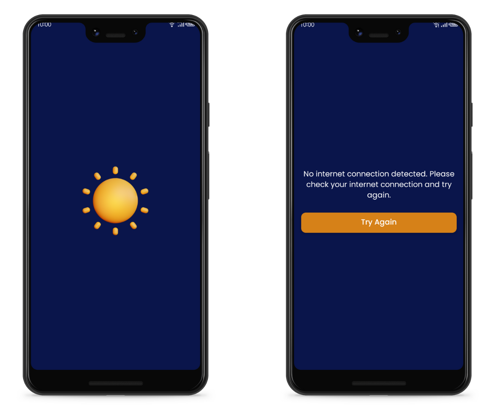

# WEATHER APP
This app provides users with accurate weather information. The app retrieves the data from OpenWeatherMap and allows the users to search for the weather in specified location, and save searched locations in favourites/local storage for later use.

## Technologies Used

* **Jetpack Compose:** A modern UI toolkit for building native Android apps
* **Jetpack Navigation:** A library for building navigation on Android
* **Room:** A library for providing local data storage on Android
* **Hilt:** A dependency injection library for Android
* **OpenWeatherMap API:** An API which lets retrieve weather data for a particular location
* **geocoder:** A library for converting between location coordinates and location names
* **Kotlin Coroutines:** A library for asynchronous programming
* **GSON:** A library for serializing/deserializing JSON data

The app requires an active **internet** connection for network calls, and then it retrieves the weather data from the API. If the user does not have an active internet connection, the app will show the user a message and won't proceed further. The user will need to click on "Try Again" button to retry.

## Features
* Search for the weather for a particular location

* Save searched locations in local storage for later use

* TODO:
(Given my need to complete this task by the weekend, while also working on another exercise for a different company and fulfilling my job responsibilities, this is the best I could achieve within these constraints.)
Handle edge cases like "Moncao" which can be city and country
Store the api key encrypted in secure storage/backend
Upgrade gradle libraries